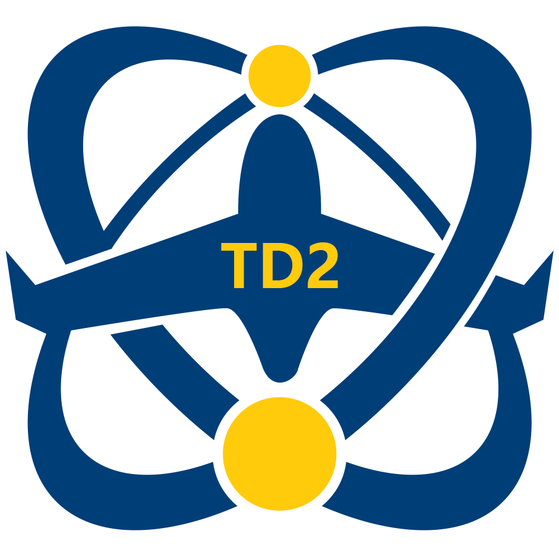
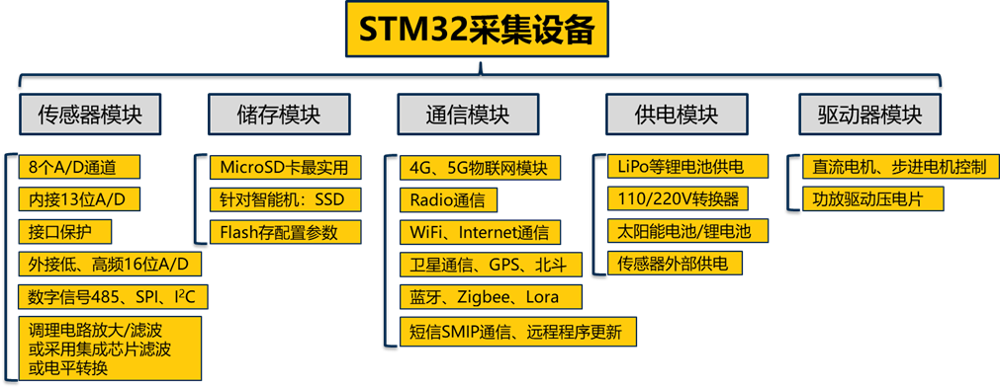

  

  <h3 align="center">IoT for Structural Health Monitoring</h3>

  

    Embedded system solution for SHM IoT applications.
     
    <a href="https://www.twodotsthreedims.com"><strong>Check out our website »</strong></a>
     
  

# Internet of Things for Structural Health Monitoring Systems

### Introduction

This organization is designed to the development of an IoT solution for Structural Health Monitoring (SHM) systems. The goal is to provide a cost-effective and reliable solution for Aerospace and Civil applications.

The main STM32 system consists of five components shown in the figure below.

    

### Contact

Hui Zhang - [@zhanghui](https://www.twodotsthreedims.com/people/zhanghui) - buaa.zhanghui@gmail.com

### License

Copyright © 2024, [TD2 Inc.](https://github.com/TwoDotsThreeDims), all rights reserved.
